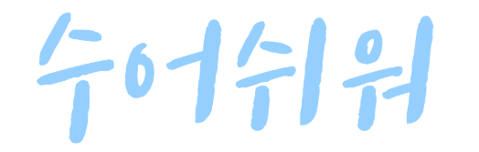
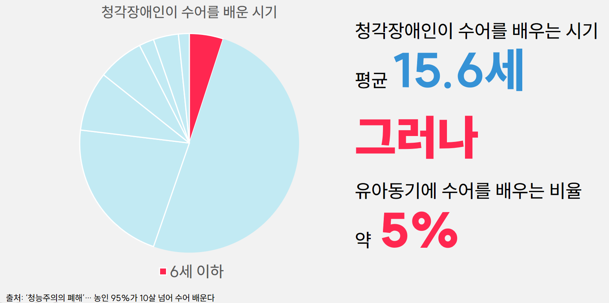
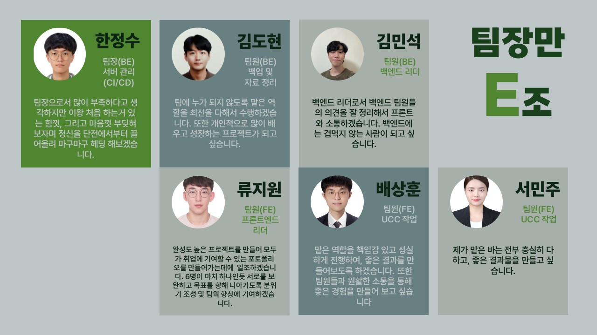
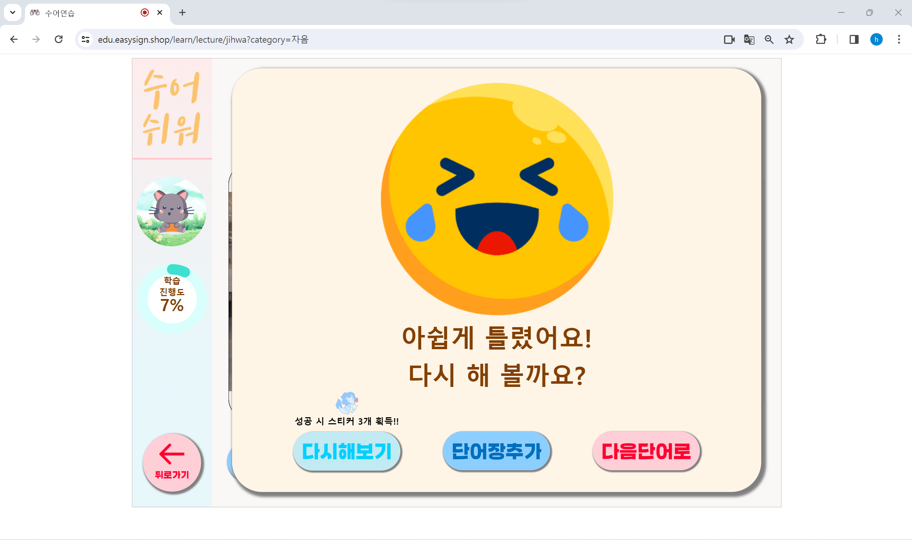

# 수어쉬워 - 수어 교육 플랫폼

## 🧩서비스 URL

**교육**

- https://edu.easysign.shop

**메인(상점, 마이페이지 등)**

- https://easysign.shop

## 🧩프로젝트 개요

**모션인식을 활용하여 배우는 수어 교육**

1. 수화언어 지문자(자음, 모음) 학습
2. 수화언어 단어 학습
3. 수화언어를 이용한 간단한 게임 플레이
4. 학습, 게임을 통한 재화로 페이스 마스크(모델) 구매 및 적용

## 🧩기획 배경

[https://youtu.be/ZkIuFB8XYwQ](https://youtu.be/ZkIuFB8XYwQ)

수화를 배우는 연령대가 평균적으로 낮지만 실제 해당 연령대에 

배우는 비율은 매우 적다.  

**이유는?**   

전문성을 갖춘 교수 인력의 부족으로 수준 높은 교육이 불가능 

→ **전문적인 교육 체계 부족**  

국립 국어원의 ‘한국수어문법’ 성인 농인 기준으로 교재 개발 

→ **농아동 및 농가족을 위한 교재 부재**   

수화 교육의 진입장벽을 해소하고

사회적 인식의 개선과 농인의 언어권 향상을 위한

**수화 교육 서비스**가 필요하다.

## 🧩팀원 소개 및 역할 분담

| Name | Part | Detail | Github |
| --- | --- | --- | --- |
| 한정수 | Front-End, AI | 팀장 |  |
| 김도현 | CI/CD, Back-End | CI/CD 팀장 및 백엔드 서브 |  |
| 김민석 | Back-End | 백엔드 팀장 |  |
| 류지원 | Front-End | 프론트엔드 팀장 |  |
| 배상훈 | Front-End, AI |  |  |
| 서민주 | Front-End | 프론트엔드 서브 |  |

## 🧩기술 스택

## 🧩개발 환경

- **BackEnd**
    - Intellij : 2023.3.2(Ultimate)
    - Java : 17.0.9
    - SERVER : AWS EC2 Ubuntu 20.04.6 LTS
    - Spring boot : 3.3.2
- **CI/CD**
    - DOCKER : Docker version 25.0.3
    - Jenkinse : Jenkins 2.442
    - NGINX : nginx/1.18.0
- **FrontEnd**
    - Router version : react-router-dom@6.21.3
    - Redux : 5.0.1
    - React : 18.2.0
- **DB**
    - MySQL : 8.0.35
    - Redis : 3.2.2
- **AI**
    - Python : 3.11.7
    - tensorflowjs : 4.17.0
    - tensorflow : 2.15.0
    - mediapipe : 0.10.9
    - scikit-learn : 1.4.0

## 🧩협업 툴

- Notion
- GitLab
- Jira
- Mattermost

## 🧩서비스 소개

### 1. 학습

**1.1 자음, 모음 강의**
> **수화도 기초부터!!**

- 강의를 보고 수화를 따라해봅니다.
- 인공지능 모델이 사용자의 행동을 인식하여 정답의 유무를 판단합니다.
- 행동이 일정 수준 이상 맞았다면 다음 강의로 넘어갑니다.
- 학습을 완료하면 스티커를 제공합니다.

- 잘 따라한 경우에는 참! 잘했어요 화면이, 잘 따라하지 못한 경우에는 아쉽게 틀렸어요! 다시 해 볼까요? 화면이 뜨게 된다.

**1.2 자음, 모음 연습**
> **기초를 탄탄하게!!**

- 상단에는 내가 따라해야 할 글자가 뜨며, 일정 시간 이상 유지하면 화면이 잠깐 깜빡이며 다음 글자로 넘어가게 됩니다.
- 강좌에서 연습한 수화를 테스트해볼 수 있습니다. 
- 해당 수화를 일정 시간 유지하면 다음 단어로 넘어갑니다.

### 2. 게임
> **게임으로 즐기는 수화 복습**

- 학습자의 단어 진행 상황을 확인하고 10개 이상의 단어를 학습했다면 해금되는 컨텐츠입니다.
- 학습자가 학습한 단어만 떨어지기 때문에 수화 복습이 가능합니다.
- 웹캠에서 인식된 수화에 해당하는 빗방울이 없어집니다. 
- 제시되는 글자를 맞추지 못해 우측 상단의 ♥ 가 다 떨어지게 되면 게임이 종료됩니다.
- 게임을 클리어하면 스티커가 제공됩니다.

### 3. 상점

**3.1 상점조회**

- 상점에서는 프로필 이미지와 배경, 그리고 카메라에 나타나는 학습자에게 씌워지는 가면을 구매할 수 있습니다.
- 학습에서 얻은 스티커를 소모하여 구매가 가능합니다.

**3.2 가면**

- 상점에서 구매한 가면은 마이페이지에서 적용이 가능합니다.
- 웹캠에 나오는 학습자의 얼굴에 해당 가면으로 다음 학습부터 적용됩니다.

## 🧩산출물

- 아키텍처 구성도

>[https://mahogany-subway-c64.notion.site/f3d1666df5524d7fa07d367e0cc690d2?pvs=4](https://www.notion.so/f3d1666df5524d7fa07d367e0cc690d2?pvs=21)

- api 명세서

>[https://mahogany-subway-c64.notion.site/API-59de950fd164496280ce991841a2c812?pvs=74](https://www.notion.so/API-59de950fd164496280ce991841a2c812?pvs=21)

- erd

>[https://mahogany-subway-c64.notion.site/ERD-f9a8b48c9839408b945088e188dcf169](https://www.notion.so/ERD-f9a8b48c9839408b945088e188dcf169?pvs=21)

- 요구사항 명세서

>[https://mahogany-subway-c64.notion.site/2989e2af1bf046d5afea6138e25b0bb7?v=6a6434e7c4504ae6b1654eceb941753c](https://www.notion.so/2989e2af1bf046d5afea6138e25b0bb7?pvs=21)

- 와이어 프레임(Figma)

>[https://www.figma.com/file/OU1Cr8MoLcxyohrJm3fosp/수어쉬워?type=design&node-id=0%3A1&mode=design&t=HlbOSCJQN4EmB2Cr-1](https://www.figma.com/file/OU1Cr8MoLcxyohrJm3fosp/%EC%88%98%EC%96%B4%EC%89%AC%EC%9B%8C?type=design&node-id=0%3A1&mode=design&t=HlbOSCJQN4EmB2Cr-1)

- UCC
>[https://youtu.be/ZkIuFB8XYwQ](https://youtu.be/ZkIuFB8XYwQ)
